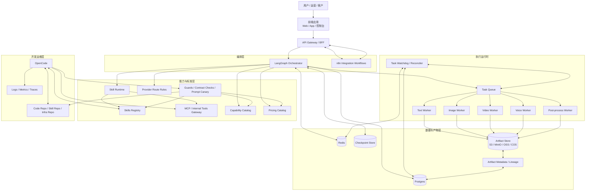

# LangGraph + n8n + Skills + OpenCode 一体化内容生产平台架构方案

- 版本：v1.0
- 生成时间：2026-03-12
- 适用目标：面向“生图、配音、视频生成、脚本/分镜生产、人工审核、发布分发”的一条龙 Agent 化应用服务
- 核心判断：`LangGraph` 负责高价值认知编排，`n8n` 负责外部系统联动，`Skills` 负责可复用能力封装，`OpenCode` 负责开发与平台运维提效；同时必须引入 `Queue + Workers + Storage + Capability Catalog + Guard Rails`

---

## 1. 方案定位

这份方案不是一个“AI 应用拼装图”，而是一份面向**内容生产平台**的架构设计。

你要做的不是简单聊天机器人，而是一个具有以下特征的系统：

- 单次任务链路长
  - 例如：主题输入 -> 脚本 -> 分镜 -> 生图 -> 配音 -> 合成视频 -> 审核 -> 发布
- 中间产物多
  - 脚本、镜头、图片、音频、字幕、视频、封面、发布文案都要保存
- 外部依赖多
  - 图像模型、视频模型、TTS、对象存储、转码服务、支付、CRM、CMS、社媒平台
- 人工参与多
  - 审核、驳回、局部重做、版本对比、最终确认
- 失败恢复要求高
  - 任务可能中断、队列可能重启、外部 provider 可能已扣费但本地状态丢失

因此，最合理的架构不是单一框架包打天下，而是分层组合：

```text
LangGraph = 核心认知编排与状态机
n8n       = 对外系统连接与自动化联动
Skills    = 可复用能力包与专业知识单元
OpenCode  = 开发与运维侧智能执行代理
Queue     = 长任务调度与削峰
Workers   = 多媒体与异步执行运行时
Storage   = Artifact 存储与分发基座
Catalog   = 模型能力、价格、策略标准目录
Guards    = 平台工程约束与契约检查
```

这份方案也吸收了两个参考方向的经验：

- `RogueGen`
  - 提供了工作流式多 Agent 产品的启发：共享状态、interrupt/resume、SSE 可观测性
- `waoowaoo`
  - 提供了工业级影视生产平台的启发：局部 LangGraph 子工作流、BullMQ worker 池、对象存储抽象、能力目录、恢复对账、守护脚本体系

所以这份文档不是“把参考项目追加到后面”，而是已经把这些设计理念融进主架构本身。

---

## 2. 一句话结论

> 把 `LangGraph` 放在认知编排层，把 `Queue + Workers` 放在执行层，把 `n8n` 放在外部联系层，把 `Skills + Capability Catalog` 放在能力标准层，把 `OpenCode` 放在开发运维层，这才是一条龙内容生产服务最稳的基础架构。

核心原因有三点：

1. 内容生产的主难点在于“状态、版本、中断恢复”，而不是单次模型调用
2. 生图、视频、配音等任务天然需要异步执行和专用 worker 池
3. 长期平台化一定会走向“能力标准化、存储抽象、恢复对账、工程守护”

---

## 3. 设计目标

这套架构要同时满足 8 个目标：

1. **核心流程可控**
   - 流程状态清楚，可暂停、可恢复、可部分重跑
2. **产物可追踪**
   - 每个图片、音频、视频都有来源、版本和引用关系
3. **执行可伸缩**
   - 文本、图像、视频、音频任务分别扩缩容
4. **外联可扩展**
   - 能轻松接飞书、Slack、Notion、CMS、CRM、支付、社媒平台
5. **能力可复用**
   - 业务知识和流程动作沉淀为 `Skills`
6. **模型可治理**
   - 模型能力、价格、默认参数、路由策略可配置可校验
7. **故障可恢复**
   - 队列重启、任务丢失、provider 中断时有对账和恢复机制
8. **工程可演进**
   - 有 guard rails、contract checks、prompt canary，防止平台逐渐失控

---

## 4. 总体架构图



---

## 5. 分层设计

### 5.1 体验层

这一层包括：

- Web 应用
- App
- 内部运营台
- 人工审核台

职责：

- 创建任务
- 展示任务进度
- 查看中间产物
- 对版本进行对比
- 人工审核、驳回、确认
- 查看成本和历史记录

不应承担：

- 主流程状态管理
- 任务恢复逻辑
- provider 调用逻辑

### 5.2 接入层

建议使用：

- API Gateway / BFF

职责：

- 鉴权与租户隔离
- 限流
- 请求参数标准化
- 会话管理
- WebSocket / SSE 输出
- 任务创建与状态查询

这一层是面向客户端的稳定边界，内部服务变动不应直接暴露给前端。

### 5.3 编排层

这一层由两部分组成，但分工必须非常清楚。

#### LangGraph

负责：

- 高价值认知流程
- 长生命周期业务状态
- 中断与恢复
- 用户反馈路由
- 部分重跑
- 多阶段 artifact 引用关系的推进

不负责：

- 大量外围 SaaS 联动
- 所有媒体重任务的直接执行

#### n8n

负责：

- 外部系统触发器
- 通知、审批、发布、同步
- CRM / CMS / 支付 / 表单 / 邮件 / 社媒联动
- 对外 webhook 工作流

不负责：

- 主状态机
- 核心 artifact 生命周期
- 深度人机中断恢复

这就是整套方案的第一条关键分工原则：

> `LangGraph` 管“生产域核心状态”，`n8n` 管“外部世界联动”。

### 5.4 执行运行时层

这是被很多初版设计低估，但对内容生产平台最关键的一层。

建议明确拆成：

- `Text Worker`
  - 负责脚本、分镜、文案、提示词、摘要等文本任务
- `Image Worker`
  - 负责生图、图像改图、图像变体、后处理
- `Voice Worker`
  - 负责 TTS、音频拼接、音频标准化
- `Video Worker`
  - 负责合成、转码、渲染、字幕合成、镜头拼装
- `Post-process Worker`
  - 负责封面裁切、压缩、上传前整理、归档

为什么必须这么拆：

- 视频任务长且重，不能阻塞文本任务
- 图像与音频的重试策略不同
- 不同 worker 的资源模型不同
  - 文本偏 I/O
  - 视频偏 CPU / GPU
  - 图像偏 GPU / provider latency

这也是 `waoowaoo` 的启发之一：它把 worker 明确拆成 `text/image/video/voice`，不是把所有异步任务塞进一个“大 worker”里。

### 5.5 能力与标准层

这是这份方案里最容易被忽略、但长期最值钱的一层。

它包括：

- `Skill Runtime`
- `Skills Registry`
- `MCP / Internal Tools Gateway`
- `Capability Catalog`
- `Pricing Catalog`
- `Provider Route Rules`
- `Guards / Contract Checks / Prompt Canary`

这层的目标是把平台从“很多脚本和 prompt 的集合”升级成“标准化能力平台”。

### 5.6 数据与产物层

至少建议有：

- `Postgres`
  - 任务、会话、项目、用户、审核、计费、artifact 元数据
- `Redis`
  - 队列、锁、缓存、短期状态
- `Checkpoint Store`
  - LangGraph 流程检查点
- `Artifact Store`
  - 图片、音频、视频、字幕、封面、日志包
- `Artifact Metadata / Lineage`
  - artifact 来源、版本、依赖关系、归档状态

### 5.7 开发运维层

这一层由：

- `OpenCode`
- 各类 repo
- 观测系统

组成。

这里要明确一个原则：

> `OpenCode` 是平台工程团队的智能施工工具，不是线上用户流量的唯一执行面。

它最适合：

- 开发新 Skill
- 改 LangGraph 节点
- 写 worker 脚本
- 调试 MCP
- 批量升级 provider SDK
- 补 guard 脚本

---

## 6. 为什么这样分层

这套分层不是拍脑袋，而是来自内容生产系统的天然约束。

### 6.1 因为认知编排和媒体执行不是一回事

例如“小说转短视频”流程里：

- 分析小说、生成脚本、拆镜头、写提示词
  - 这是认知编排
- 生图、合成、转码、字幕渲染
  - 这是执行任务

前者适合 `LangGraph`，后者适合 `Queue + Workers`。

这和 `waoowaoo` 的实现很一致：它把 `story-to-script`、`script-to-storyboard` 这类高价值内容子流程放进图编排，而没有试图让整个平台只靠一张大图。

### 6.2 因为恢复逻辑必须是平台级能力

当任务中断时，系统真正要面对的问题不是“再试一次”这么简单，而是：

- DB 里是 `processing`
- 队列里 job 丢了
- 外部 provider 可能已经收到了任务
- 本地 artifact 可能只产出了一半

所以平台必须有独立的：

- `Task Watchdog`
- `Task Reconciler`
- `Orphaned Task Recovery`

这同样是 `waoowaoo` 给的强启发：启动时恢复、重入队、持续对账，都是正式平台必须具备的能力。

### 6.3 因为模型治理必须做成标准目录

接多模型以后，平台很快会出现这些问题：

- 哪个模型支持哪些参数
- 哪个 provider 对哪个模型是别名
- 不同模型的默认分辨率、时长、质量档位如何映射
- 计费规则怎么统一

这些内容绝不能只埋在代码里或环境变量里，必须沉淀成：

- `Capability Catalog`
- `Pricing Catalog`
- `Provider Route Rules`

这也是 `waoowaoo` 里很值得学的地方：能力目录和价格目录是“平台标准文件”，而不是散落在业务代码里的常量。

---

## 7. 核心角色分工

### 7.1 LangGraph 的职责边界

`LangGraph` 在这套方案里负责“认知编排”与“业务状态推进”。

适合放到 LangGraph 里的节点：

- 用户需求解析
- 选题分析
- 脚本策划
- 分镜设计
- 提示词生成
- 品牌/合规审校
- 审核路由
- 发布前摘要整理

适合在 LangGraph 状态中保存的内容：

- 结构化需求
- 当前脚本版本
- 分镜版本
- 图片任务清单
- 音频任务清单
- 审核意见
- 已确认 artifact 引用
- 当前阶段

不适合让 LangGraph 直接承担的事情：

- 长视频转码本体
- 图像生成 provider 的高并发轮询
- 大量外部系统集成

### 7.2 n8n 的职责边界

`n8n` 应该作为“外部联系总线”。

典型场景：

- 表单提交后调用主 API 创建任务
- 付款成功后释放生产额度
- 生成完成后把结果同步到 Notion / 飞书 / CRM
- 审核消息推送给运营
- 自动发布到 CMS 或社媒平台
- 失败后发送告警

不建议让它管理：

- 任务主状态
- artifact lineage
- 高复杂度重跑逻辑

### 7.3 Skills 的职责边界

Skill 是“可复用能力单元”，不是主流程引擎。

一个 Skill 应该封装：

- 领域知识
- 流程规则
- 模板
- 脚本
- 限制条件
- 依赖资源

推荐 Skill 类型：

- `short-video-packaging`
- `brand-style-guard`
- `storyboard-style-guide`
- `image-prompt-composer`
- `voice-persona-setup`
- `ffmpeg-video-assemble`
- `publish-social`

Skill 的目标是让平台具备“可移植的专业能力”，而不是让 prompt 到处复制。

### 7.4 OpenCode 的职责边界

OpenCode 最适合服务于平台工程团队。

最合理的用法：

1. 按 Skill 规范生成新能力脚手架
2. 为 LangGraph 节点补工具调用
3. 为 worker 编写新任务处理器
4. 批量升级 provider SDK
5. 维护 guard scripts
6. 做集成验证和代码审查

不建议：

- 让 OpenCode 直接承接线上高并发业务任务
- 不经隔离地直接接触生产关键资源

---

## 8. 推荐的工作流拆法

### 8.1 认知编排图

这部分由 `LangGraph` 驱动。

典型主图：

```text
需求解析
  -> 目标平台策略选择
  -> 脚本策划
  -> 分镜生成
  -> 提示词与资产计划
  -> 品牌/合规审校
  -> 生图/配音/合成任务编排
  -> 审核中断
  -> 发布准备
```

关键特征：

- 有清楚的共享状态
- 有 interrupt / resume
- 支持部分重跑
- 支持驳回后回到某个阶段

### 8.2 执行任务图

这部分由 `Queue + Workers` 驱动。

例如：

```text
image-task:
  取任务 -> 调模型 -> 轮询 -> 下载 -> 后处理 -> 上传 -> 回写 artifact

voice-task:
  取任务 -> 调 TTS -> 拼接 -> 归一化 -> 上传 -> 回写 artifact

video-task:
  取任务 -> 拉取素材 -> Remotion/FFmpeg 合成 -> 输出 -> 上传 -> 回写 artifact
```

这里的关键不是“多 Agent”，而是“执行弹性与幂等性”。

### 8.3 外部联动图

这部分由 `n8n` 驱动。

例如：

```text
支付成功
  -> 调主 API 解锁额度
  -> 通知运营
  -> 记录 CRM 标签

审核通过
  -> 触发发布
  -> 回写 CMS
  -> 推送社媒
  -> 飞书通知客户
```

---

## 9. 一条典型生产链路

以“输入一段小说，生成一条短视频”为例。

1. 用户提交任务
   - 输入小说内容、风格、目标平台、预算、语言、品牌要求
2. API 创建项目、任务与初始状态
3. LangGraph 启动认知编排
   - 分析题材
   - 生成脚本
   - 生成分镜
   - 生成每个镜头的素材计划
4. Skill Runtime 被调用
   - 使用 `storyboard-style-guide`
   - 使用 `brand-style-guard`
   - 使用 `image-prompt-composer`
5. LangGraph 写入待执行任务
   - image tasks
   - voice tasks
   - video tasks
6. Queue 分发给各类 worker
7. worker 执行并持续回写 artifact
8. Task Watchdog 负责对账和恢复
9. LangGraph 在素材齐备后进入审核中断点
10. 审核通过后恢复流程
11. n8n 负责发布、通知、回写 CRM/CMS
12. 系统归档项目与 artifact lineage

这一条链路正好体现了整套方案的核心：

- 认知图
- 执行队列
- artifact 存储
- 审核中断
- 外部联动

缺一不可。

---

## 10. Skill 体系设计

### 10.1 Skill 不应只是一份 Markdown

如果要长期平台化，Skill 应该从“说明文档”升级为“可校验的能力包”。

建议结构：

```text
skills/
  short-video-packaging/
    SKILL.md
    skill.schema.json
    skill.lock.json
    templates/
    scripts/
    references/
    tests/
```

### 10.2 Skill Runtime 的职责

建议单独做 `Skill Runtime Service`，不要让线上流程直接到处读本地 Skill 文件夹。

职责：

- 索引 Skill
- 解析 `SKILL.md`
- 校验 schema
- 管理版本
- 管理输入输出契约
- 记录审计日志
- 管理权限与配额
- 将 Skill 暴露为 MCP tool 或内部 API

### 10.3 Skill 的消费方式

Skill 可以有三种主要消费方式：

1. `LangGraph` 调 Skill Runtime
2. `OpenCode` 直接加载 Skill 做工程任务
3. `MCP` 把 Skill 暴露为通用工具

### 10.4 Skill 的平台化演进方向

长期看，Skill 不只是知识包，还可以成为：

- 内部能力市场
- 可版本化的生产模板
- 团队间复用的工作标准

这部分理念，本质上和 `waoowaoo` 里的 `capability catalog` 是同类思路：  
都在把“隐性规则”沉淀成“显式标准”。

---

## 11. Capability Catalog 与 Pricing Catalog

这一层是整个平台可治理的前提。

### 11.1 为什么必须做 Catalog

没有 catalog，系统会很快出现：

- 不同模块对同一模型理解不同
- provider 别名不统一
- 参数支持情况混乱
- 计费逻辑散落

### 11.2 推荐目录结构

```text
standards/
  capabilities/
    image.catalog.json
    video.catalog.json
    audio.catalog.json
    llm.catalog.json
  pricing/
    image.pricing.json
    video.pricing.json
    audio.pricing.json
  provider-routing/
    fallback-rules.json
    alias-rules.json
```

### 11.3 Catalog 应包含什么

每条能力目录至少包含：

- `modelType`
- `provider`
- `modelId`
- `capabilities`
- `defaults`
- `compatibility aliases`

每条价格目录至少包含：

- `计费方式`
- `能力维度`
- `分辨率/时长/质量档`
- `价格规则`
- `最低计费单位`

### 11.4 Catalog 的工程要求

- 必须有 schema 校验
- 必须有重复项检测
- 必须有别名解析规则
- 必须有 CI 检查

这一部分直接吸收了 `waoowaoo` 的工程理念：  
模型能力和价格不能靠业务代码硬编码，而要成为“平台标准”。

---

## 12. Artifact 与 Storage 设计

### 12.1 Artifact 是平台核心资产

对这类平台而言，最重要的不是一段对话，而是：

- 原始文本
- 提示词
- 脚本
- 图片
- 音频
- 视频
- 字幕
- 封面

这些都属于 artifact。

### 12.2 存储层必须抽象

推荐统一 `Storage Provider Interface`，对业务层暴露：

- `upload`
- `delete`
- `deleteMany`
- `signedUrl`
- `resolveStorageKey`
- `getBuffer`

底层可切换：

- MinIO
- S3
- OSS
- COS
- Local

这样做的价值：

- 避免把 provider SDK 散落在业务代码里
- 迁移存储后影响范围小
- 更容易统一签名 URL 和访问控制

### 12.3 不要只存 URL，要存 Storage Key

artifact 元数据建议至少保存：

- `artifact_id`
- `project_id`
- `task_id`
- `kind`
- `storage_key`
- `content_type`
- `size`
- `version`
- `source_artifact_ids`
- `status`

原因很简单：

- URL 不稳定
- key 更适合追踪和迁移

### 12.4 Artifact 生命周期

建议定义：

- `raw`
- `derived`
- `approved`
- `published`
- `archived`
- `deleted`

同时要有：

- 归档策略
- 垃圾回收策略
- 未引用媒体扫描

这部分同样吸收了 `waoowaoo` 的思路：  
对象存储不只是“上传文件”，而是平台级治理对象。

---

## 13. Task Queue、Workers 与恢复机制

### 13.1 为什么必须引入队列

因为这类任务天然具有：

- 长耗时
- 高延迟
- 外部依赖
- 可失败重试
- 批量执行

如果没有队列，主服务会迅速变成不稳定的混合进程。

### 13.2 推荐 worker 拆分

建议至少拆：

- `worker-text`
- `worker-image`
- `worker-video`
- `worker-voice`
- `worker-postprocess`

后续可继续拆：

- `worker-render-gpu`
- `worker-lipsync`
- `worker-publish`

### 13.3 任务状态机

建议统一：

- `queued`
- `processing`
- `waiting_review`
- `retrying`
- `completed`
- `failed`
- `cancelled`

### 13.4 Task Watchdog / Reconciler

这是必须单独存在的子系统。

职责：

- 启动恢复
- 孤儿任务检测
- 队列/DB 对账
- provider 状态回补
- 心跳检测
- 超时回收
- 避免重复提交外部任务

这部分理念直接来自 `waoowaoo` 的三段式恢复设计：

- 把 `processing` 归回 `queued`
- 重新入队丢失的 queued 任务
- 启动 watchdog 做持续对账

### 13.5 幂等与补偿

每类 worker 都要有：

- 幂等 key
- 外部任务 externalId
- 重试次数
- 错误类型
- 补偿策略

否则内容生产平台会面临：

- 重复扣费
- 重复生成
- 重复上传
- 状态错乱

---

## 14. Guard Rails 与质量保障

内容生产平台如果要长期演进，不能只靠单测。

建议至少有四类质量保障：

### 14.1 Contract Checks

例如：

- API route contract
- task payload contract
- artifact metadata contract
- capability catalog contract
- pricing catalog contract

### 14.2 Architecture Guards

例如：

- 禁止绕过统一模型网关
- 禁止直接在 API handler 中调用 provider
- 禁止多个 source of truth
- 禁止绕过 artifact sdk
- 禁止 skill runtime 之外私自解析 skill

### 14.3 Prompt Canary

例如：

- 关键 prompt 的 JSON 输出 canary
- 样板脚本质量回归测试
- 分镜结构回归样本

### 14.4 Media Consistency Checks

例如：

- 图片 URL / storage key 规范检查
- 未引用媒体扫描
- 字幕/视频时长一致性检查

这部分强烈建议作为正式平台能力，而不是临时脚本。  
这也是 `waoowaoo` 给出的最重要工业化启发之一。

---

## 15. OpenCode 的最佳使用方式

这套架构里，OpenCode 最有价值的角色是“平台工程加速器”。

### 15.1 适合它做的事情

- 生成 Skill 脚手架
- 生成 worker handler 模板
- 批量重构 provider 接入代码
- 增补 guard scripts
- 校验 repo 结构一致性
- 维护 MCP server
- 审查和修补代码

### 15.2 不适合它做的事情

- 直接处理线上大流量
- 成为唯一生产执行入口
- 无隔离访问生产核心资源

### 15.3 建议的协作方式

1. 产品或架构师定义需求
2. 工程师给 OpenCode 指定 Skill 或任务模板
3. OpenCode 在 repo 中生成或修改：
   - LangGraph 节点
   - worker handler
   - MCP tool
   - SKILL.md
   - tests
   - guards
4. 工程师 review
5. CI 通过后上线

---

## 16. 推荐目录结构

```text
platform/
  apps/
    api-gateway/
    frontend/
    orchestrator/
    skill-runtime/
    mcp-gateway/
    watchdog/
    worker-text/
    worker-image/
    worker-video/
    worker-voice/
    worker-postprocess/
  workflows/
    n8n/
      publish-workflow.json
      approval-workflow.json
      payment-trigger.json
  skills/
    short-video-packaging/
    brand-style-guard/
    image-prompt-composer/
    ffmpeg-video-assemble/
  standards/
    capabilities/
    pricing/
    provider-routing/
    prompt-canary/
  packages/
    shared-types/
    artifact-sdk/
    provider-clients/
    task-sdk/
  infra/
    docker/
    k8s/
    terraform/
  docs/
    architecture/
    runbooks/
```

---

## 17. 分阶段落地路线

### 阶段 1：MVP

目标：

- 跑通 1 条主链路
- 支持基本审核
- 支持基础发布

建议：

- `LangGraph` 先只做 1 张主图
- `n8n` 只做通知和发布
- 先上 `worker-text / worker-image / worker-video`
- Skill 只做 3 到 5 个核心能力
- 存储先统一到 MinIO / S3 兼容接口

### 阶段 2：平台化

目标：

- 引入标准和恢复能力

建议：

- 上 `Skill Runtime`
- 上 `Capability Catalog / Pricing Catalog`
- 上 `Task Watchdog`
- 上 artifact metadata / lineage
- 上 guard scripts 与 prompt canary

### 阶段 3：规模化

目标：

- 多租户
- 多 provider
- 高可靠

建议：

- provider 智能路由
- worker 细分扩缩容
- 成本控制与 A/B 路由
- 内部 Skill Marketplace
- 更完整的审核与回滚系统

---

## 18. 最终建议

如果你要把这套方案真正做成平台，我的建议很明确：

1. **让 LangGraph 管认知编排，不要让它直接吞下所有异步执行**
2. **尽早引入 Queue + Workers，不要把媒体执行压在主服务**
3. **把 n8n 放在外围联动层，而不是主状态层**
4. **把 Skills 提升为标准化能力包，而不是零散 prompt 文件**
5. **把模型能力、计费、路由规则做成 catalog**
6. **把对象存储和 artifact 管理当成一等公民**
7. **把恢复对账和 guard rails 当成正式平台组件**
8. **让 OpenCode 服务于开发与平台演进，而不是替代生产执行**

最终，这不是一个“AI 功能集合”，而应该是一个清晰分层的生产平台：

```text
LangGraph = 认知主脑
Queue     = 执行调度
Workers   = 多媒体运行时
n8n       = 外部联系总线
Skills    = 可复用能力标准
Catalog   = 模型与计费治理中心
Storage   = Artifact 基础设施
Guards    = 工程质量闸门
OpenCode  = 平台工程加速器
```

这才是更接近正式可运营产品的架构落点。

---

## 19. 参考信息

本方案融合参考了以下资料与仓库：

- OpenCode Skills 文档：
  - https://opencode.ai/docs/skills
- OpenCode 官方仓库：
  - https://github.com/opencode-ai/opencode
- `waoowaoo` 官方仓库：
  - https://github.com/saturndec/waoowaoo
- 关于开放 Agent Skills 生态的公开报道：
  - https://www.techradar.com/pro/anthropic-takes-the-fight-to-openai-with-enterprise-ai-tools-and-theyre-going-open-source-too
- Agent Skills 生态站点示例：
  - https://www.agentskills.in/

说明：

- `OpenCode` 与 `Skills` 主要用于确定开放能力包生态与开发代理定位
- `waoowaoo` 主要用于吸收工业级内容生产平台的工程化理念
- 本文为基于这些能力边界和参考实现推导出的完整平台架构方案

